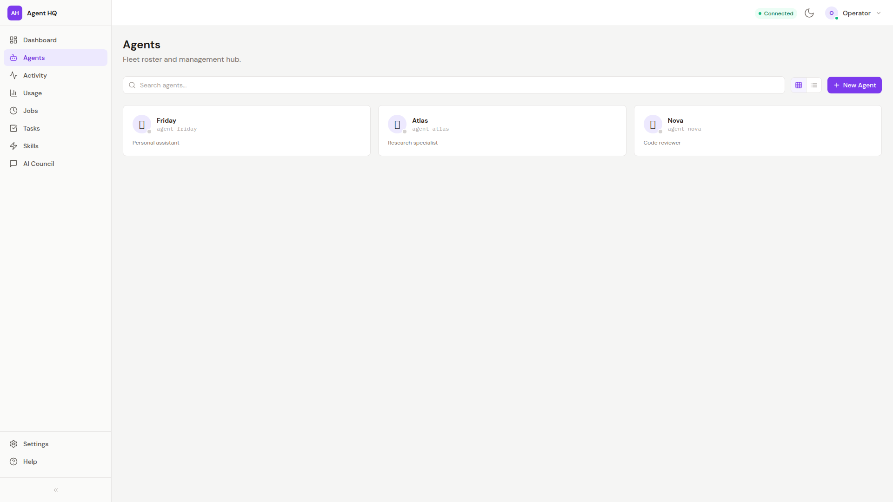

# Agents Fleet Roster with CRUD Management

**ADW ID:** fb641441
**Date:** 2026-02-22
**Specification:** specs/issue-15-adw-fb641441-sdlc_planner-agents-fleet-roster-crud.md

## Overview

Transforms the minimal Agents placeholder page into a fully-featured fleet roster and management hub. Operators can browse agents in card grid or table views with real-time search, view detailed agent identity side panels, and perform full CRUD operations (create, edit, delete) — all backed by new FastAPI routes that proxy to the OpenClaw Gateway via WebSocket RPC.

## Screenshots





## What Was Built

- **AgentRoster** — Main roster container with real-time search, grid/table view toggle, and "+ New Agent" button
- **AgentCard** — Compact card showing emoji avatar, agent name, ID, theme snippet, online/offline status dot, and hover-revealed edit/delete actions
- **AgentDetail** — Right-side panel with full agent identity (emoji, name, ID, theme, avatar) and a collapsible workspace file browser
- **AgentFormModal** — Create/edit modal with fields for id, name, workspace, emoji, and avatar; validates required fields with inline errors
- **AgentDeleteModal** — Confirmation dialog with optional "Also delete workspace files" checkbox
- **Backend CRUD routes** — `POST /api/gateway/agents`, `PATCH /api/gateway/agents/{id}`, `DELETE /api/gateway/agents/{id}`, `GET /api/gateway/agents/{id}/files`, `GET /api/gateway/agents/{id}/files/content`
- **Pydantic models** — `AgentCreateRequest`, `AgentUpdateRequest`, `AgentDeleteRequest` for request body validation
- **Frontend service functions** — `createAgent`, `updateAgent`, `deleteAgent`, `fetchAgentFiles`, `fetchAgentFileContent` in `gateway.js`
- **Real-time presence** — SSE `presence` events from GatewayContext update per-agent online/offline indicators live
- **Toast notifications** — Auto-dismissing (3s) success/error banners for all CRUD operations
- **Backend tests** — Full pytest suite for all new routes in `test_agent_crud_routes.py`
- **E2E test spec** — `.claude/commands/e2e/test_agents_fleet_roster_crud.md` covering the complete CRUD flow

## Technical Implementation

### Files Modified

- `app/client/src/pages/Agents.jsx`: Rebuilt as stateful orchestrator with all CRUD handlers, presence subscriptions, modal state, and toast logic; replaced minimal card list with `AgentRoster` component
- `app/client/src/services/gateway.js`: Added `createAgent`, `updateAgent`, `deleteAgent`, `fetchAgentFiles`, `fetchAgentFileContent` API functions
- `app/server/gateway_routes.py`: Added 5 new FastAPI routes — POST, PATCH, DELETE for agents and 2 GET routes for workspace files; all use existing `_proxy_rpc()` helper
- `app/server/gateway_models.py`: Added `AgentCreateRequest`, `AgentUpdateRequest`, `AgentDeleteRequest` Pydantic models

### New Files

- `app/client/src/components/agents/AgentRoster.jsx`: Search, view toggle, grid/table layout, empty states (`data-testid="agent-roster"`)
- `app/client/src/components/agents/AgentCard.jsx`: Emoji avatar, status dot, hover edit/delete icons (`data-testid="agent-card"`)
- `app/client/src/components/agents/AgentDetail.jsx`: Identity side panel + file browser (`data-testid="agent-detail"`)
- `app/client/src/components/agents/AgentFormModal.jsx`: Create/edit form with validation (`data-testid="agent-form-modal"`)
- `app/client/src/components/agents/AgentDeleteModal.jsx`: Delete confirmation with deleteFiles checkbox (`data-testid="agent-delete-modal"`)
- `app/client/src/components/agents/index.js`: Barrel export for all agent components
- `app/server/tests/test_agent_crud_routes.py`: Pytest suite (221 lines) covering success, 503 disconnected, and 422 validation cases
- `.claude/commands/e2e/test_agents_fleet_roster_crud.md`: E2E test specification

### Key Changes

- All new backend routes proxy to the Gateway using the existing `_proxy_rpc()` helper — no new error handling patterns needed
- `Agents.jsx` subscribes to `events` from `useGateway()`, filters for `event === 'presence'`, and maintains a `Set<agentId>` for live online/offline state
- Agent ID is immutable after creation; the `id` field is disabled in the edit modal and excluded from `AgentUpdateRequest`
- The `deleteFiles` query param defaults to `false`; only sent as `true` when the checkbox is checked
- Toast notifications are implemented as simple state-driven JSX with `setTimeout` — no additional library

## How to Use

1. Navigate to **Agents** in the sidebar (`/agents`)
2. **Browse** the fleet in grid view (default) or switch to table view using the toggle buttons in the roster header
3. **Search** by typing in the search bar — filters agents by name or theme in real-time (client-side)
4. **View details** by clicking an agent card — opens a right-side panel with full identity and a workspace file browser
5. **Create** a new agent by clicking **+ New Agent**, filling in the required fields (id, name, workspace), and submitting
6. **Edit** an agent by clicking the pencil icon on its card or from the detail panel
7. **Delete** an agent by clicking the trash icon, optionally checking "Also delete workspace files", then confirming

## Configuration

No additional configuration required. The feature uses:
- Existing `GatewayClient` and `_proxy_rpc()` infrastructure
- Existing SSE stream from `GatewayContext` for presence events
- Existing `fetchAgents` and `fetchAgentIdentity` functions (already in `gateway.js`)

## Testing

**Backend unit tests:**
```bash
cd app/server && uv run pytest tests/test_agent_crud_routes.py
```

**Frontend lint:**
```bash
cd app/client && npx eslint src/ --max-warnings=0 --quiet
```

**Frontend build:**
```bash
cd app/client && npm run build
```

**E2E tests:**
Run the `/e2e:test_agents_fleet_roster_crud` skill, which validates the full roster rendering, view toggle, search, create modal, delete confirmation, and detail panel.

## Notes

- Agent IDs are immutable — the `id` field cannot be changed after creation via `agents.update`
- The `deleteFiles` Gateway param only fires when explicitly set to `true`; the gateway defaults to preserving workspace files
- If a `presence` event arrives for an unknown agent ID, it is silently ignored (no crash)
- Empty state "No agents yet" includes a secondary "+ New Agent" prompt button
- Grid layout: 3-column on large screens (`lg:grid-cols-3`), 2-column on tablets (`sm:grid-cols-2`), single column on mobile
